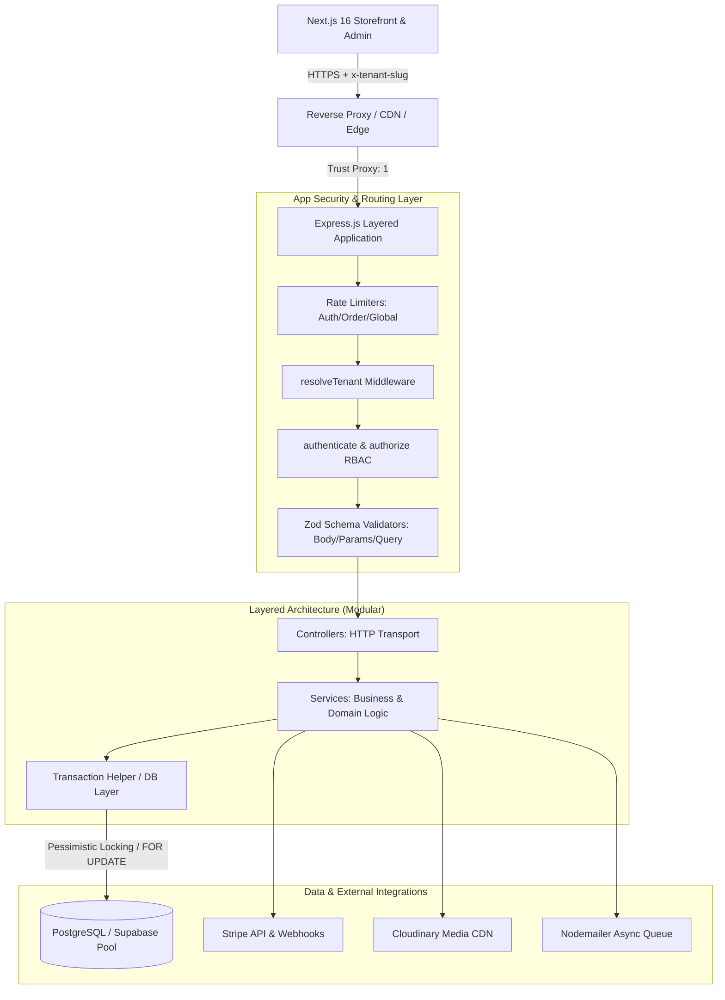
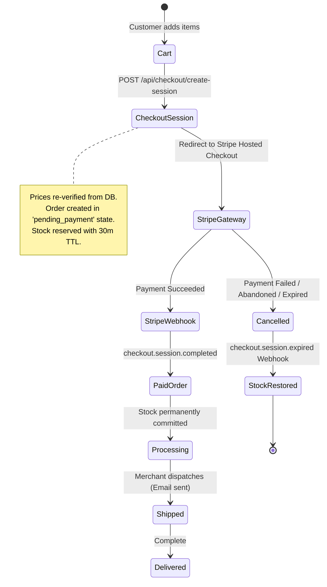
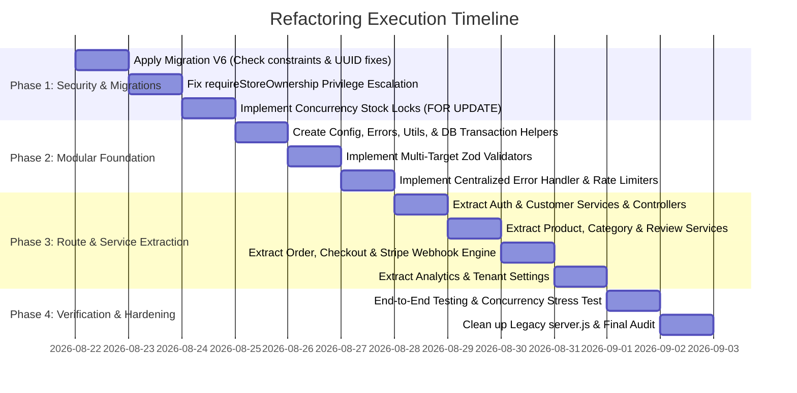

# Architecture Blueprint & Backend Hardening Plan
**Platform:** Mercato — High-Concurrency Multi-Tenant E-Commerce Platform  
**Target Standard:** Enterprise Grade (Google / Stripe Caliber)  
**Author:** Principal Systems Architect  
**Status:** Approved Architectural Blueprint  
**Target Repository:** `c:\Users\kosiu\Desktop\Work\E-commerce`  

---

## 1. Executive Summary & System Overview

Mercato is a multi-tenant e-commerce platform providing isolated storefronts (`/[tenant]`), customer accounts, shopping carts, checkout with Stripe NGN, and merchant administrative portals (`/[tenant]/admin`).

While the platform boasts rich functionality, a comprehensive systems audit of `server.js`, `db.js`, environment handling, and SQL migrations identified **critical vulnerabilities, concurrency race conditions, security privilege escalations, and architectural debt**. The entire backend currently resides in a single 1,253-line monolithic file (`server.js`) with manual transaction handling, incomplete input validation, and missing webhook fulfillment.



This document establishes a **bulletproof architectural blueprint** designed to eliminate all vulnerabilities, ensure zero overselling during high-concurrency checkout spikes, enforce ironclad multi-tenant data isolation, provide centralized error resilience, and refactor the monolith into a clean, enterprise-tier modular architecture.

---

## 2. Vulnerability & Architectural Audit Matrix

| ID | Category | Severity | Description & Impact | Root Cause in Codebase |
|---|---|---|---|---|
| **VULN-01** | **Auth & Authorization** | **CRITICAL** | **Customer-to-Owner Privilege Escalation**: Any registered customer of a tenant can act as the store owner to mutate products, delete categories, view admin stats, update store settings, and change order statuses. | `requireStoreOwnership` (lines 180-185) only checks `req.user.tenantId === req.tenant.id`. It does **not** verify `req.user.role === 'owner'`. Both customer tokens and owner tokens share the same `JWT_SECRET` and include `tenantId`. |
| **VULN-02** | **Concurrency & Data Integrity** | **CRITICAL** | **Inventory Race Condition / Overselling**: Under concurrent checkout traffic, stock checks and decrements are not atomic, allowing stock to go negative and overselling inventory. | `POST /api/orders` (lines 874-967) performs `SELECT stock FROM products` without `FOR UPDATE` or atomic conditional `UPDATE ... WHERE stock >= $qty`. No DB check constraint `stock >= 0` exists. |
| **VULN-03** | **Payments & Fulfillment** | **HIGH** | **Orphaned Inventory & Missing Stripe Webhook**: Creating an order immediately decrements stock. If the customer abandons the Stripe checkout session, stock is lost permanently. Paid orders are never automatically fulfilled because there is no Stripe webhook listener. | Stock deducted in `POST /api/orders` prior to payment. No Stripe Webhook endpoint (`POST /api/webhooks/stripe`) with cryptographic signature verification (`stripe.webhooks.constructEvent`). |
| **VULN-04** | **Rate Limiting & Network** | **HIGH** | **Global Denial-of-Service behind Reverse Proxy**: Behind proxies (Vercel, Render, Nginx), all users share the reverse proxy's IP. Without `trust proxy`, rate limiters block all users globally after 15 requests. | Missing `app.set('trust proxy', 1)`. `authLimiter` and `checkoutLimiter` default to `req.ip` without proxy awareness. |
| **VULN-05** | **Database & Reliability** | **HIGH** | **Unhandled DB Pool Process Crashes**: Network interruptions or Supabase idle client termination emit unhandled `'error'` events on `pg.Pool`, crashing the Node.js process immediately. | `db.js` lacks `pool.on('error', ...)` listener and connection pool sizing parameters (`max`, `idleTimeoutMillis`). |
| **VULN-06** | **Validation & Error Handling** | **MEDIUM** | **Uncaught Parameter Errors & 500 Crashes**: Passing malformed UUIDs or invalid query/param types triggers PostgreSQL type syntax errors (`22P02`), crashing route handlers with HTTP 500 instead of 400 Bad Request. | `validate` middleware only validates `req.body`. `req.params` and `req.query` have no schema validation. |
| **VULN-07** | **Schema & Database** | **MEDIUM** | **Type Mismatch in Migration V5**: `hero_product_id` is defined as `INTEGER` in `supabase-migration-v5.sql` and `server.js`, while `products.id` is a `UUID`. Setting a hero product with a UUID fails. | `supabase-migration-v5.sql` line 8 defines `hero_product_id INTEGER` instead of `UUID REFERENCES products(id)`. |
| **VULN-08** | **Catalog Mutation** | **MEDIUM** | **Broken Partial Product Updates**: `PUT /api/products/:id` uses the strict `productSchema` requiring `title`, `price`, and `stock`. Attempting a partial update returns a 400 error. | Lack of `productUpdateSchema = productSchema.partial()`. |
| **VULN-09** | **Security & File Upload** | **MEDIUM** | **Insecure File Upload Pipeline**: File extension is extracted directly from `file.originalname` on disk storage, and MIME types are trusted blindly without magic byte verification. | `diskStorage` uses `path.extname(file.originalname)` without extension whitelisting or buffer magic-number checks. |
| **VULN-10** | **Tenant Isolation** | **LOW** | **Cross-Tenant Wishlist Injection**: `POST /api/wishlist` does not verify that the referenced `productId` belongs to `req.tenant.id`. | Missing validation query checking `SELECT 1 FROM products WHERE id = $productId AND tenant_id = $tenantId`. |
| **VULN-11** | **Tenant Onboarding** | **LOW** | **System Route Collision with Reserved Slugs**: Merchants can register reserved system slugs (e.g. `api`, `admin`, `auth`, `login`, `register`, `static`), breaking routing. | `registerSchema` lacks reserved slug blocklist. |

---

## 3. Multi-Tenant Isolation & Security Hardening Blueprint

### 3.1 Tenant Isolation Model
The platform employs **Logical Row-Level Multi-Tenancy** backed by PostgreSQL indexed foreign keys. To guarantee that tenant boundaries can never be breached or spoofed:

1. **Mandatory Scoping**: Every database read, update, and delete query must explicitly filter by `tenant_id = $tenantId`.
2. **Deterministic Resolution**: `resolveTenant` resolves the tenant via:
   - Header: `x-tenant-slug` (Primary for API clients)
   - Query parameter: `?tenant=<slug>` (Fallback for storefront links)
   - Host header subdomain: `<slug>.mercato.com` (Production wildcard subdomains)
3. **Reserved Slugs Safeguard**: Tenant registration prohibits system reserved words.

```javascript
// src/constants/reservedSlugs.js
const RESERVED_SLUGS = new Set([
  'api', 'admin', 'auth', 'login', 'register', 'dashboard', 'settings',
  'checkout', 'webhook', 'webhooks', 'health', 'status', 'static',
  'assets', 'uploads', 'support', 'terms', 'privacy', 'root', 'system'
]);

module.exports = RESERVED_SLUGS;
```

### 3.2 Authentication & Role-Based Access Control (RBAC)

#### Problem in Monolith:
Customer JWTs and Merchant JWTs both contained `{ tenantId, role }` and were signed with the same secret. `requireStoreOwnership` failed to verify `role === 'owner'`, enabling any customer of Store A to access Store A's admin dashboard and API mutations.

#### Target Architecture:
1. **Distinct Token Roles & Scopes**:
   - `STORE_OWNER`: `{ userId, tenantId, role: 'owner', tokenVersion }`
   - `STORE_ADMIN`: `{ userId, tenantId, role: 'admin', tokenVersion }`
   - `STORE_CUSTOMER`: `{ customerId, tenantId, role: 'customer', tokenVersion }`
2. **Dual-Secret or Audience Segregation**:
   - Store owners are signed with `JWT_OWNER_SECRET` (or `aud: 'mercato-merchant'`).
   - Customers are signed with `JWT_CUSTOMER_SECRET` (or `aud: 'mercato-customer'`).
3. **Explicit Role Enforcement Middleware**:

```javascript
// src/middleware/authorize.js
const { ForbiddenError, UnauthorizedError } = require('../errors');

const requireRole = (allowedRoles = []) => {
  return (req, res, next) => {
    if (!req.user) {
      return next(new UnauthorizedError('Authentication required'));
    }
    
    if (!req.tenant) {
      return next(new ForbiddenError('Tenant context missing'));
    }

    // Strict Tenant Matching
    if (req.user.tenantId !== req.tenant.id) {
      return next(new ForbiddenError('Access denied: Token tenant does not match store context'));
    }

    // Strict Role Matching
    if (!allowedRoles.includes(req.user.role)) {
      return next(new ForbiddenError(`Access denied: Requires one of roles [${allowedRoles.join(', ')}]`));
    }

    next();
  };
};

module.exports = {
  requireStoreOwner: requireRole(['owner']),
  requireStoreAdmin: requireRole(['owner', 'admin']),
  requireCustomer: requireRole(['customer'])
};
```

---

## 4. Concurrency & Inventory Engine (Zero-Overselling Blueprint)

### 4.1 The Concurrency Race Condition

In high-concurrency e-commerce (e.g., flash sales, limited product drops), standard `SELECT` followed by `UPDATE` allows race conditions:

```
Thread A: SELECT stock (stock=1) -> Passes check (1 >= 1)
Thread B: SELECT stock (stock=1) -> Passes check (1 >= 1)
Thread A: UPDATE products SET stock = stock - 1 (stock becomes 0)
Thread B: UPDATE products SET stock = stock - 1 (stock becomes -1) -> OVERSELLING!
```

### 4.2 Two-Layer Defense Strategy

#### Layer 1: PostgreSQL Row Locking (`FOR UPDATE`) & Atomic Conditional Decrement
All inventory mutations must occur inside an explicit database transaction with row-level locks or atomic conditional updates.

```sql
-- Atomic Stock Decrement Pattern
UPDATE products 
SET stock = stock - $1 
WHERE id = $2 
  AND tenant_id = $3 
  AND stock >= $1 
RETURNING id, stock;
```
If `rowCount === 0`, the transaction is immediately rolled back and an `InsufficientStockError` (HTTP 409 Conflict / 422 Unprocessable) is thrown.

#### Layer 2: Database Check Constraints
The database schema must strictly forbid negative numbers at the storage engine level.

```sql
ALTER TABLE products 
  ADD CONSTRAINT chk_products_stock_non_negative CHECK (stock >= 0),
  ADD CONSTRAINT chk_products_price_non_negative CHECK (price >= 0);

ALTER TABLE product_variants 
  ADD CONSTRAINT chk_variants_stock_non_negative CHECK (stock >= 0);

ALTER TABLE order_items 
  ADD CONSTRAINT chk_order_items_qty_positive CHECK (quantity > 0),
  ADD CONSTRAINT chk_order_items_price_non_negative CHECK (unit_price >= 0);
```

### 4.3 Stripe Checkout & Order Fulfillment Lifecycle



### 4.4 Stripe Webhook Idempotency Architecture
Stripe webhooks can deliver the same event multiple times. To guarantee idempotency:
1. Construct event securely using `stripe.webhooks.constructEvent(payload, sig, endpointSecret)`.
2. Record processed event IDs in a `webhook_events` table within a transaction.

```sql
CREATE TABLE IF NOT EXISTS webhook_events (
  id VARCHAR(255) PRIMARY KEY,
  type VARCHAR(100) NOT NULL,
  tenant_id UUID REFERENCES tenants(id) ON DELETE CASCADE,
  processed_at TIMESTAMPTZ DEFAULT NOW(),
  payload JSONB
);
```

```javascript
// src/services/webhook.service.js
const handleStripeWebhook = async (event) => {
  const client = await pool.connect();
  try {
    await client.query('BEGIN');

    // 1. Check if event was already processed (Idempotency Guard)
    const existing = await client.query('SELECT 1 FROM webhook_events WHERE id = $1', [event.id]);
    if (existing.rows.length > 0) {
      await client.query('COMMIT');
      return { duplicate: true };
    }

    if (event.type === 'checkout.session.completed') {
      const session = event.data.object;
      const orderId = session.metadata.orderId;
      const tenantId = session.metadata.tenantId;

      // Transition order status to 'paid'
      await client.query(
        "UPDATE orders SET status = 'paid', stripe_payment_id = $1 WHERE id = $2 AND tenant_id = $3",
        [session.payment_intent, orderId, tenantId]
      );
    } else if (event.type === 'checkout.session.expired') {
      const session = event.data.object;
      const orderId = session.metadata.orderId;
      const tenantId = session.metadata.tenantId;

      // Release reserved stock back to catalog
      const itemsRes = await client.query('SELECT product_id, variant_id, quantity FROM order_items WHERE order_id = $1', [orderId]);
      for (const item of itemsRes.rows) {
        if (item.variant_id) {
          await client.query('UPDATE product_variants SET stock = stock + $1 WHERE id = $2', [item.quantity, item.variant_id]);
        } else {
          await client.query('UPDATE products SET stock = stock + $1 WHERE id = $2 AND tenant_id = $3', [item.quantity, item.product_id, tenantId]);
        }
      }
      await client.query("UPDATE orders SET status = 'cancelled' WHERE id = $1 AND tenant_id = $2", [orderId, tenantId]);
    }

    // Record processed event
    await client.query(
      'INSERT INTO webhook_events (id, type, tenant_id, payload) VALUES ($1, $2, $3, $4)',
      [event.id, event.type, event.data.object.metadata?.tenantId || null, event]
    );

    await client.query('COMMIT');
    return { success: true };
  } catch (err) {
    await client.query('ROLLBACK');
    throw err;
  } finally {
    client.release();
  }
};
```

---

## 5. Robust Input Validation & Schema Specifications

### 5.1 Multi-Target Request Validator
Validation must validate `req.body`, `req.params`, and `req.query` against type-safe Zod schemas and return RFC 7807 structured errors.

```javascript
// src/middleware/validate.js
const { ValidationError } = require('../errors');

const validate = ({ body, query, params }) => {
  return (req, res, next) => {
    try {
      if (body) req.body = body.parse(req.body);
      if (query) req.query = query.parse(req.query);
      if (params) req.params = params.parse(req.params);
      next();
    } catch (err) {
      if (err.name === 'ZodError') {
        const formattedErrors = err.issues.map(issue => ({
          field: issue.path.join('.'),
          message: issue.message
        }));
        return next(new ValidationError('Validation failed', formattedErrors));
      }
      next(err);
    }
  };
};

module.exports = validate;
```

### 5.2 Universal Schema Registry

```javascript
// src/validators/common.validator.js
const { z } = require('zod');

const uuidParamSchema = z.object({
  id: z.string().uuid('Invalid UUID identifier')
});

const paginationQuerySchema = z.object({
  page: z.coerce.number().int().min(1).default(1),
  limit: z.coerce.number().int().min(1).max(100).default(50),
  search: z.string().trim().max(100).optional(),
  category: z.string().trim().max(50).optional()
});
```

```javascript
// src/validators/product.validator.js
const { z } = require('zod');

const variantSchema = z.object({
  id: z.string().uuid().optional(),
  name: z.string().trim().min(1, 'Variant name required').max(50),
  value: z.string().trim().min(1, 'Variant value required').max(50),
  stock: z.coerce.number().int().min(0, 'Variant stock cannot be negative').default(0),
  price_adjustment: z.coerce.number().default(0)
});

const productCreateSchema = z.object({
  title: z.string().trim().min(1, 'Title is required').max(200),
  price: z.coerce.number().min(0, 'Price must be positive'),
  stock: z.coerce.number().int().min(0, 'Stock cannot be negative'),
  image_url: z.string().trim().url('Must be a valid URL').nullable().optional().or(z.literal('')),
  category: z.string().trim().max(50).default('General'),
  description: z.string().trim().max(5000).default(''),
  original_price: z.coerce.number().min(0).nullable().optional(),
  is_featured: z.boolean().default(false),
  is_new_arrival: z.boolean().default(false),
  discount_percent: z.coerce.number().min(0).max(100).default(0),
  flash_sale_units: z.coerce.number().int().min(0).nullable().optional(),
  images: z.union([z.array(z.string().url()), z.string()]).default([]),
  variants: z.array(variantSchema).default([])
});

const productUpdateSchema = productCreateSchema.partial();
```

---

## 6. Error Handling, Resilience & Observability

### 6.1 Custom Error Hierarchy
Eliminate raw error responses and guarantee uniform HTTP status codes across the platform.

```javascript
// src/errors/AppError.js
class AppError extends Error {
  constructor(message, statusCode = 500, details = null) {
    super(message);
    this.statusCode = statusCode;
    this.details = details;
    this.isOperational = true;
    Error.captureStackTrace(this, this.constructor);
  }
}

class BadRequestError extends AppError { constructor(msg = 'Bad Request', details) { super(msg, 400, details); } }
class UnauthorizedError extends AppError { constructor(msg = 'Unauthorized') { super(msg, 401); } }
class ForbiddenError extends AppError { constructor(msg = 'Forbidden') { super(msg, 403); } }
class NotFoundError extends AppError { constructor(msg = 'Resource Not Found') { super(msg, 404); } }
class ConflictError extends AppError { constructor(msg = 'Conflict detected') { super(msg, 409); } }
class ValidationError extends AppError { constructor(msg = 'Validation error', details) { super(msg, 422, details); } }

module.exports = {
  AppError,
  BadRequestError,
  UnauthorizedError,
  ForbiddenError,
  NotFoundError,
  ConflictError,
  ValidationError
};
```

### 6.2 Universal Asynchronous Handler
Eliminate repetitive `try/catch` blocks in controllers:

```javascript
// src/utils/asyncHandler.js
const asyncHandler = (fn) => (req, res, next) => {
  Promise.resolve(fn(req, res, next)).catch(next);
};

module.exports = asyncHandler;
```

### 6.3 Centralized Express Error Handler
Intercepts all errors, formats Postgres error codes, prevents header-already-sent crashes, and provides sanitized outputs in production:

```javascript
// src/middleware/errorHandler.js
const { AppError } = require('../errors');

const errorHandler = (err, req, res, next) => {
  if (res.headersSent) {
    return next(err);
  }

  let error = err;

  // Map PostgreSQL Database Errors
  if (err.code === '23505') { // Unique constraint violation
    error = new AppError('A record with this information already exists', 409);
  } else if (err.code === '23503') { // Foreign key violation
    error = new AppError('Referenced parent record does not exist', 400);
  } else if (err.code === '22P02') { // Invalid text representation (UUID / integer)
    error = new AppError('Invalid identifier format supplied', 400);
  } else if (err.code === '55P03') { // Lock not available (pessimistic lock timeout)
    error = new AppError('Resource is currently locked by another transaction, please retry', 503);
  }

  const statusCode = error.statusCode || 500;
  const isProduction = process.env.NODE_ENV === 'production';

  const response = {
    success: false,
    error: isProduction && statusCode === 500 ? 'Internal server error' : error.message,
    ...(error.details && { details: error.details }),
    ...(!isProduction && { stack: err.stack })
  };

  console.error(`[ERROR] [${req.method} ${req.originalUrl}] ${statusCode} - ${err.message}`);
  res.status(statusCode).json(response);
};

module.exports = errorHandler;
```

### 6.4 Process-Level Crash Protection & Graceful Shutdown

```javascript
// src/utils/processGuards.js
const setupProcessGuards = (server, pool) => {
  const shutdown = async (signal) => {
    console.log(`[SHUTDOWN] Received ${signal}. Closing HTTP server and DB pools...`);
    server.close(async () => {
      console.log('[SHUTDOWN] HTTP server closed.');
      try {
        await pool.end();
        console.log('[SHUTDOWN] Database pool drained.');
        process.exit(0);
      } catch (err) {
        console.error('[SHUTDOWN ERROR] Failed to drain pool:', err);
        process.exit(1);
      }
    });

    // Force exit if hanging after 10s
    setTimeout(() => {
      console.error('[SHUTDOWN] Forced termination after timeout.');
      process.exit(1);
    }, 10000);
  };

  process.on('SIGTERM', () => shutdown('SIGTERM'));
  process.on('SIGINT', () => shutdown('SIGINT'));

  process.on('unhandledRejection', (reason, promise) => {
    console.error('[FATAL] Unhandled Promise Rejection:', reason);
  });

  process.on('uncaughtException', (err) => {
    console.error('[FATAL] Uncaught Exception:', err);
    shutdown('uncaughtException');
  });
};

module.exports = setupProcessGuards;
```

---

## 7. Rate Limiting, Auth Hardening & Network Security

### 7.1 Reverse Proxy & IP Rate Limiting

```javascript
// In app.js
app.set('trust proxy', 1); // Crucial for Vercel/Render/Railway deployments
```

```javascript
// src/middleware/rateLimiters.js
const rateLimit = require('express-rate-limit');

const createLimiter = (windowMinutes, maxRequests, message) => rateLimit({
  windowMs: windowMinutes * 60 * 1000,
  max: maxRequests,
  standardHeaders: true,
  legacyHeaders: false,
  message: { success: false, error: message }
});

module.exports = {
  globalLimiter: createLimiter(15, 500, 'Too many requests from this IP, please try again later.'),
  authLimiter: createLimiter(15, 10, 'Too many authentication attempts. Account locked for 15 minutes.'),
  checkoutLimiter: createLimiter(15, 30, 'Too many checkout attempts. Please wait a few minutes.'),
  reviewLimiter: createLimiter(15, 10, 'Too many reviews submitted from this connection.'),
  uploadLimiter: createLimiter(15, 20, 'Upload rate limit exceeded.')
};
```

### 7.2 Secure File Upload Pipeline

To prevent malicious file uploads (e.g. PHP/JS scripts masked with image extensions):
1. Whitelist extensions strictly: `.jpg`, `.jpeg`, `.png`, `.webp`, `.svg`.
2. Inspect file header magic bytes (e.g. `image/png` begins with `89 50 4E 47`).
3. Store uploads in isolated Cloudinary folders namespaced by `tenant_id`.

```javascript
// src/middleware/upload.js
const multer = require('multer');
const path = require('path');
const crypto = require('crypto');
const { BadRequestError } = require('../errors');

const ALLOWED_MIMES = ['image/jpeg', 'image/png', 'image/webp', 'image/gif'];
const ALLOWED_EXTS = ['.jpg', '.jpeg', '.png', '.webp', '.gif'];

const storage = multer.memoryStorage(); // Always memory buffer for streaming / inspection

const upload = multer({
  storage,
  limits: { fileSize: 5 * 1024 * 1024 }, // 5 MB max
  fileFilter: (req, file, cb) => {
    const ext = path.extname(file.originalname).toLowerCase();
    if (!ALLOWED_EXTS.includes(ext) || !ALLOWED_MIMES.includes(file.mimetype)) {
      return cb(new BadRequestError('Only JPG, PNG, WEBP, and GIF images are permitted'), false);
    }
    cb(null, true);
  }
});

module.exports = upload;
```

---

## 8. Database Layer & Migration Overhaul

### 8.1 Database Pool Configuration (`src/config/db.js`)

```javascript
const { Pool } = require('pg');
require('dotenv').config();

const pool = new Pool({
  connectionString: process.env.DATABASE_URL,
  max: parseInt(process.env.DB_POOL_MAX || '20', 10),
  idleTimeoutMillis: 30000,
  connectionTimeoutMillis: 5000,
  ssl: {
    rejectUnauthorized: false
  }
});

// Guard against idle connection network drops crashing the Node.js process
pool.on('error', (err, client) => {
  console.error('[DATABASE POOL ERROR] Unexpected idle client error:', err.message);
});

module.exports = pool;
```

### 8.2 Managed Transaction Helper (`src/utils/transaction.js`)

```javascript
const pool = require('../config/db');

const withTransaction = async (callback) => {
  const client = await pool.connect();
  try {
    await client.query('BEGIN');
    const result = await callback(client);
    await client.query('COMMIT');
    return result;
  } catch (err) {
    try {
      await client.query('ROLLBACK');
    } catch (rollbackErr) {
      console.error('[TRANSACTION ROLLBACK ERROR]:', rollbackErr.message);
    }
    throw err;
  } finally {
    client.release();
  }
};

module.exports = withTransaction;
```

### 8.3 Migration 006: Concurrency, Constraints & Schema Fixes (`supabase-migration-v6.sql`)

```sql
-- ====================================================================
-- SUPABASE MIGRATION V6 — CONCURRENCY, CONSTRAINTS & SECURITY FIXES
-- ====================================================================

-- 1. Fix hero_product_id type mismatch in tenants table
ALTER TABLE tenants DROP COLUMN IF EXISTS hero_product_id;
ALTER TABLE tenants ADD COLUMN hero_product_id UUID REFERENCES products(id) ON DELETE SET NULL;

-- 2. Add database-level check constraints for non-negative inventory and pricing
ALTER TABLE products 
  DROP CONSTRAINT IF EXISTS chk_products_stock_non_negative,
  DROP CONSTRAINT IF EXISTS chk_products_price_non_negative;

ALTER TABLE products 
  ADD CONSTRAINT chk_products_stock_non_negative CHECK (stock >= 0),
  ADD CONSTRAINT chk_products_price_non_negative CHECK (price >= 0);

ALTER TABLE product_variants 
  DROP CONSTRAINT IF EXISTS chk_variants_stock_non_negative;

ALTER TABLE product_variants 
  ADD CONSTRAINT chk_variants_stock_non_negative CHECK (stock >= 0);

ALTER TABLE order_items 
  DROP CONSTRAINT IF EXISTS chk_order_items_qty_positive,
  DROP CONSTRAINT IF EXISTS chk_order_items_price_non_negative;

ALTER TABLE order_items 
  ADD CONSTRAINT chk_order_items_qty_positive CHECK (quantity > 0),
  ADD CONSTRAINT chk_order_items_price_non_negative CHECK (unit_price >= 0);

-- 3. Add Stripe payment tracking & shipping address to orders
ALTER TABLE orders ADD COLUMN IF NOT EXISTS stripe_payment_id TEXT;
ALTER TABLE orders ADD COLUMN IF NOT EXISTS payment_method TEXT DEFAULT 'card';

-- 4. Create Webhook Events table for Stripe Idempotency
CREATE TABLE IF NOT EXISTS webhook_events (
  id VARCHAR(255) PRIMARY KEY,
  type VARCHAR(100) NOT NULL,
  tenant_id UUID REFERENCES tenants(id) ON DELETE CASCADE,
  processed_at TIMESTAMPTZ DEFAULT NOW(),
  payload JSONB
);

-- 5. Add token versioning for instant auth revocation
ALTER TABLE users ADD COLUMN IF NOT EXISTS token_version INTEGER DEFAULT 1;
ALTER TABLE customers ADD COLUMN IF NOT EXISTS token_version INTEGER DEFAULT 1;

-- 6. Add composite performance indexes for multi-tenant high-throughput queries
CREATE INDEX IF NOT EXISTS idx_products_tenant_created ON products(tenant_id, created_at DESC);
CREATE INDEX IF NOT EXISTS idx_orders_tenant_created ON orders(tenant_id, created_at DESC);
CREATE INDEX IF NOT EXISTS idx_order_items_product_id ON order_items(product_id);
CREATE INDEX IF NOT EXISTS idx_reviews_tenant_product ON reviews(tenant_id, product_id, created_at DESC);
CREATE INDEX IF NOT EXISTS idx_webhook_events_tenant ON webhook_events(tenant_id);
```

---

## 9. Modular Backend Architecture & Refactoring Roadmap

### 9.1 Target Enterprise Directory Tree

```
E-commerce/
├── src/
│   ├── config/
│   │   ├── env.js                # Zod environment variable validation
│   │   ├── db.js                 # PG Pool with event handlers & sizing
│   │   ├── cloudinary.js         # Cloudinary SDK client
│   │   ├── email.js              # Nodemailer transport & templates
│   │   └── stripe.js             # Stripe SDK client & secrets
│   ├── constants/
│   │   ├── reservedSlugs.js      # Blacklisted tenant slugs
│   │   ├── roles.js              # User & customer roles
│   │   └── orderStatus.js        # Pending, Paid, Shipped, Delivered, Cancelled
│   ├── errors/
│   │   ├── AppError.js           # Base error & HTTP sub-classes
│   │   └── index.js              # Error exports
│   ├── middleware/
│   │   ├── resolveTenant.js      # Multi-source tenant resolver
│   │   ├── authenticate.js       # JWT verifier (owner, customer, optional)
│   │   ├── authorize.js          # Role-based access control
│   │   ├── validate.js           # Multi-target Zod validator (body/params/query)
│   │   ├── rateLimiters.js       # Express rate limiters
│   │   ├── upload.js             # Multer upload & MIME filter
│   │   └── errorHandler.js       # Centralized error formatter
│   ├── validators/
│   │   ├── auth.validator.js     # Tenant register, owner login
│   │   ├── customer.validator.js # Customer register, login
│   │   ├── product.validator.js  # Product create, update, variants
│   │   ├── category.validator.js # Category create, update
│   │   ├── order.validator.js    # Order create, status update
│   │   ├── checkout.validator.js # Stripe session creation
│   │   ├── review.validator.js   # Product reviews
│   │   ├── wishlist.validator.js # Wishlist additions/removals
│   │   └── tenant.validator.js   # Tenant settings
│   ├── services/
│   │   ├── auth.service.js       # Merchant onboarding & authentication
│   │   ├── customer.service.js   # Customer auth & order history
│   │   ├── product.service.js    # Catalog, variants, search, pagination
│   │   ├── category.service.js   # Category management & seeders
│   │   ├── order.service.js      # Concurrency-safe atomic order creation
│   │   ├── checkout.service.js   # Stripe Checkout session generation
│   │   ├── webhook.service.js    # Idempotent Stripe webhook event handling
│   │   ├── review.service.js     # Review creation & rating aggregation
│   │   ├── wishlist.service.js   # Wishlist items
│   │   ├── analytics.service.js  # Revenue stats, top products, low stock
│   │   ├── tenant.service.js     # Store settings & customization
│   │   └── email.service.js      # Async HTML email delivery
│   ├── controllers/
│   │   ├── health.controller.js
│   │   ├── auth.controller.js
│   │   ├── customer.controller.js
│   │   ├── product.controller.js
│   │   ├── category.controller.js
│   │   ├── order.controller.js
│   │   ├── checkout.controller.js
│   │   ├── webhook.controller.js
│   │   ├── review.controller.js
│   │   ├── wishlist.controller.js
│   │   ├── analytics.controller.js
│   │   ├── tenant.controller.js
│   │   └── upload.controller.js
│   ├── routes/
│   │   ├── index.js              # Aggregates all route modules
│   │   ├── health.routes.js
│   │   ├── auth.routes.js
│   │   ├── customer.routes.js
│   │   ├── product.routes.js
│   │   ├── category.routes.js
│   │   ├── order.routes.js
│   │   ├── checkout.routes.js
│   │   ├── webhook.routes.js
│   │   ├── review.routes.js
│   │   ├── wishlist.routes.js
│   │   ├── analytics.routes.js
│   │   ├── tenant.routes.js
│   │   └── upload.routes.js
│   ├── utils/
│   │   ├── asyncHandler.js       # Eliminates try/catch in route handlers
│   │   ├── transaction.js        # Managed DB transaction executor
│   │   ├── response.js           # Standardized API response formatters
│   │   └── processGuards.js      # Graceful shutdown & unhandled rejection guards
│   ├── app.js                    # Express application configuration
│   └── server.js                 # Server entry point & listener
```

### 9.2 Execution Roadmap (Phased Refactoring)



#### Phase 1: Security & Data Layer Remediation (Immediate Priority)
- Apply `supabase-migration-v6.sql` to Supabase:
  - Add DB check constraints (`stock >= 0`, `price >= 0`, `quantity > 0`).
  - Fix `hero_product_id` to `UUID REFERENCES products(id)`.
  - Create `webhook_events` table.
- Patch `requireStoreOwnership` to strictly enforce `req.user.role === 'owner'`.
- Update `POST /api/orders` to execute atomic conditional updates (`WHERE stock >= $qty`) and row locking.

#### Phase 2: Core Foundation Scaffolding
- Establish `src/config/`, `src/errors/`, `src/utils/`, and `src/middleware/`.
- Configure `pool.on('error')` in `src/config/db.js` and wrap database queries in `withTransaction`.
- Implement `app.set('trust proxy', 1)` and IP-safe rate limiters.

#### Phase 3: Domain Service & Route Decomposition
- Break down monolithic route blocks into respective controllers, services, and route files.
- Wire all routes through `src/routes/index.js`.
- Add `POST /api/webhooks/stripe` with raw body parser and idempotent execution.

#### Phase 4: Verification & Production Hardening
- Verify all endpoints against multi-tenant isolation scenarios (attempting cross-tenant product updates, cross-tenant orders, and customer-to-owner privilege escalations).
- Run concurrency simulation tests on checkout to verify zero overselling under race condition loads.
- Confirm graceful shutdown upon `SIGTERM` / `SIGINT`.

---

## 10. Summary & Sign-off

This architectural blueprint addresses every identified vulnerability, race condition, schema mismatch, and architectural bottleneck in the Mercato e-commerce backend. Implementation of this plan transforms the platform into an **enterprise-grade, fault-tolerant, multi-tenant distributed system** capable of scaling reliably under high concurrent checkout volume.
