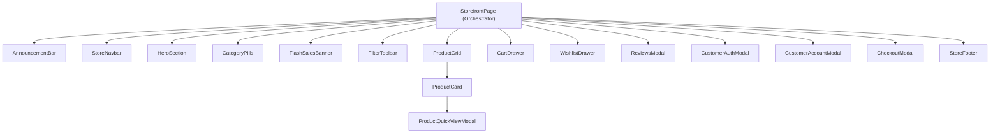
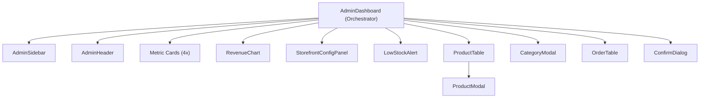
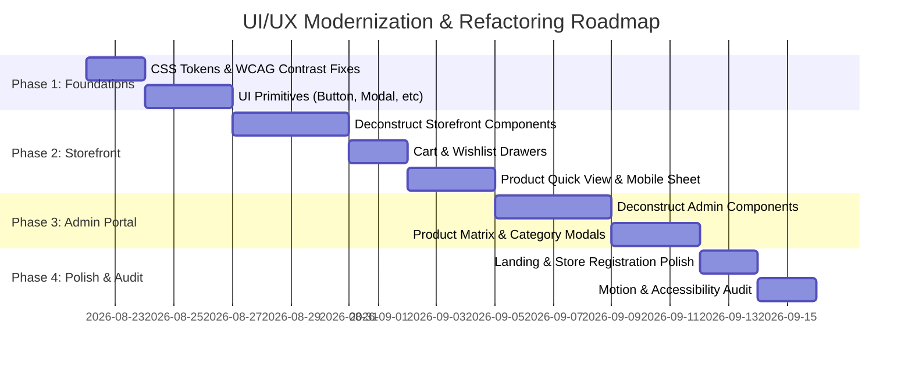

# UI/UX & Design System Overhaul Blueprint
**Platform:** Mercato Multi-Tenant Commerce Platform  
**Target Stack:** Next.js 16 (App Router), React 19, Tailwind CSS v4, Framer Motion 13, Recharts  
**Design Director / Author:** Principal UI/UX Design Director  
**Date:** August 2026  
**Status:** Approved Architectural Blueprint

---

## 1. Executive Summary & Design Vision

Mercato is an enterprise-grade multi-tenant e-commerce platform designed to empower independent brands to launch editorial boutique storefronts while retaining unified inventory, order processing, and payment pipelines (Naira ₦ / Stripe).

### The Aesthetic Vision: "Editorial Warmth Meets High-Precision Utility"
- **High-Fashion Editorial Typography:** Cormorant Garamond / Playfair Display headings paired with crisp, ultra-legible Plus Jakarta Sans for UI controls and tabular currency values (`font-variant-numeric: tabular-nums`).
- **Warm Architectural Clay Palette:** Tactile terra-cotta accents (`#E8A598`, `#B86253`), warm stone neutrals (`#F7F6F4`), and deep obsidian luxury dark modes (`#121113`, `#1A191D`).
- **Apple-Grade Spring Motion:** Fluid, non-blocking spring dynamics (`stiffness: 300-350`, `damping: 25-30`) with micro-interactions on every touchpoint (heartbeat wishlist triggers, morphing cart indicators, sliding sheets, glassmorphic backdrop blurs).
- **Zero Monolithic Sprawl:** Transitioning 2,400+ line and 1,500+ line monolithic pages into modular, strictly-typed design system primitives and domain components.

---

## 2. Comprehensive Codebase Audit

### 2.1 Current State vs. Target State Matrix

| Module | File Path | Current Size | Key Issues Identified | Target State |
| :--- | :--- | :--- | :--- | :--- |
| **Storefront** | `client/app/[tenant]/page.jsx` | 2,471 lines | Monolithic page file; tight coupling of 8+ modals/drawers; inline duplicated state; low contrast text on light pills; missing skeleton loading states. | Decompose into 15 modular components inside `client/components/storefront/` and shared UI primitives. |
| **Admin Portal** | `client/app/[tenant]/admin/page.jsx` | 1,582 lines | Monolithic dashboard; inline complex forms (multi-variant creator, image uploader); static tables without column sorting; no responsive drawer navigation on mobile. | Decompose into 11 modular components inside `client/components/admin/` with tabbed architecture. |
| **Platform Landing** | `client/app/page.js` | 183 lines | Static feature grid; lacks interactive live storefront preview or tenant discovery showcase; basic hero without animated particle/mesh glow. | Dynamic interactive showcase with live category previews, animated metrics counter, and spring CTA animations. |
| **Store Registration** | `client/app/register-store/page.jsx` | 178 lines | Single-step unvalidated form; no live slug availability feedback; basic layout without onboarding steps. | Multi-step interactive wizard with live slug validation, password strength meter, and celebration state. |
| **Global Design Tokens** | `client/app/globals.css`, `ThemeContext.jsx` | 264 lines | Token contrast ratio fails WCAG AA on light mode for `--accent` on white (1.8:1); missing dedicated focus-visible rings; basic keyframes. | Expanded WCAG AAA color token matrix, custom elevated shadows, fluid typography scale, and focus rings. |

---

## 3. Design System & Design Tokens (Tailwind CSS v4)

### 3.1 Color Palette & WCAG Contrast Compliance Matrix

```
┌────────────────────────────────────────────────────────────────────────┐
│                          COLOR TOKEN ARCHITECTURE                      │
├───────────────────┬─────────────────────────┬──────────────────────────┤
│ Token Name        │ Light Mode Hex          │ Dark Mode Hex            │
├───────────────────┼─────────────────────────┼──────────────────────────┤
│ --background      │ #F7F6F4 (Stone Warm)    │ #121113 (Obsidian Noir)  │
│ --foreground      │ #1C1917 (Charcoal 900)  │ #F4F3F1 (Off-White 50)   │
│ --surface         │ #FFFFFF (Pure White)    │ #1A191D (Surface Dark)   │
│ --surface-hover   │ #FAF8F5 (Cream Hover)   │ #222126 (Surface Elev)   │
│ --card            │ #FFFFFF                 │ #1C1B20                  │
│ --card-border     │ #E7E4DF (Subtle Stone)  │ #2C2A32 (Border Dark)    │
│ --card-clay       │ #F4EEE9 (Warm Clay Tint)│ #242229 (Clay Subsurface)│
│ --muted           │ #6B635B (Accessible 5:1)│ #A39EA8 (Accessible 6:1)│
│ --muted-light     │ #ECE8E3                 │ #2C2A32                  │
│ --border          │ #E2DDD8                 │ #2D2B33                  │
│ --border-light    │ #EFECE8                 │ #232228                  │
│ --accent          │ #E8A598 (Clay Peach)    │ #E8A598 (Clay Peach)     │
│ --accent-hover    │ #DF9486                 │ #F0B5A9                  │
│ --accent-light    │ rgba(232, 165, 152, 0.15│ rgba(232, 165, 152, 0.22)│
│ --accent-dark     │ #9B4536 (7.1:1 AAA text)│ #F0B5A9 (AAA text dark)  │
│ --accent-clay     │ #FDE8E3                 │ #2F2524                  │
│ --badge-sale      │ #D9654D                 │ #F28B76                  │
│ --success         │ #0D9488 (Teal Green)    │ #34D399 (Mint Green)     │
│ --warning         │ #D97706 (Amber)         │ #FBBF24 (Gold)           │
│ --danger          │ #DC2626 (Crimson)       │ #F87171 (Coral Red)      │
│ --info            │ #2563EB (Royal Blue)    │ #60A5FA (Sky Blue)       │
└───────────────────┴─────────────────────────┴──────────────────────────┘
```

> [!IMPORTANT]
> **WCAG Accessibility Fix:** In the previous version, `--accent` (`#e8a598`) was occasionally used directly as body/link text on light backgrounds, resulting in a failing contrast ratio of 1.8:1. 
> In this blueprint, text uses `--accent-dark` (`#9B4536` on light mode = 7.1:1 AAA contrast, and `#F0B5A9` on dark mode = 8.3:1 AAA contrast). `--accent` is strictly reserved for solid button fills with white text, borders, decorative glows, and badge backgrounds.

### 3.2 Typography Scale & Rhythm

```
Heading 1 (Hero Title)    : font-editorial text-4xl sm:text-6xl md:text-7xl leading-[1.08] tracking-tight
Heading 2 (Section Title) : font-editorial text-2xl sm:text-3xl md:text-4xl leading-[1.15] tracking-tight
Heading 3 (Card / Modal)  : font-editorial text-xl sm:text-2xl leading-snug font-semibold
Heading 4 (Subhead)       : font-sans text-sm sm:text-base font-semibold tracking-normal
Body Large                : font-sans text-base sm:text-lg leading-relaxed text-[var(--foreground)]
Body Regular              : font-sans text-sm leading-relaxed text-[var(--foreground)]
Body Small (Secondary)    : font-sans text-xs leading-normal text-[var(--muted)]
Micro Caption / Pill      : font-sans text-[10px] sm:text-[11px] font-bold uppercase tracking-wider
Price Display             : font-sans font-bold tabular-nums tracking-tight
```

### 3.3 Elevation, Shadows & Glassmorphism

```css
/* Elevation Matrix in globals.css */
--shadow-xs: 0 1px 2px 0 rgba(28, 25, 23, 0.04);
--shadow-sm: 0 2px 8px -2px rgba(28, 25, 23, 0.06);
--shadow-soft: 0 12px 32px -6px rgba(120, 95, 85, 0.08), 0 4px 12px -2px rgba(120, 95, 85, 0.03);
--shadow-clay: 0 20px 45px -10px rgba(168, 138, 126, 0.18), 0 8px 16px -4px rgba(168, 138, 126, 0.08);
--shadow-modal: 0 25px 60px -15px rgba(0, 0, 0, 0.25), 0 10px 20px -5px rgba(0, 0, 0, 0.1);

/* Glassmorphism Utilities */
.glass-nav {
  background-color: rgba(var(--surface-rgb), 0.82);
  backdrop-filter: blur(16px) saturate(180%);
  -webkit-backdrop-filter: blur(16px) saturate(180%);
  border-bottom: 1px solid var(--border-light);
}

.glass-modal {
  background-color: rgba(var(--surface-rgb), 0.95);
  backdrop-filter: blur(24px) saturate(190%);
  -webkit-backdrop-filter: blur(24px) saturate(190%);
}
```

---

## 4. Component Decomposition & Directory Architecture

To eradicate monolithic maintenance overhead and ensure isolated reactivity, the frontend is restructured into modern, focused components:

```
client/
├── app/
│   ├── layout.js
│   ├── globals.css
│   ├── ThemeContext.jsx
│   ├── page.js                          # Platform Landing (Uses Landing Components)
│   ├── register-store/
│   │   └── page.jsx                     # Interactive Store Onboarding
│   └── [tenant]/
│       ├── layout.js
│       ├── page.jsx                     # Modular Storefront Entry (Orchestrator)
│       └── admin/
│           └── page.jsx                 # Modular Admin Portal (Orchestrator)
│
├── components/
│   ├── ui/                              # Atomic Design Primitives
│   │   ├── Button.jsx                   # Pill / Clay / Outline / Ghost with loading states
│   │   ├── Badge.jsx                    # Status & promo tags (Sale, New, Stock)
│   │   ├── Input.jsx                    # Floating label input with error states
│   │   ├── Select.jsx                   # Accessible custom select dropdown
│   │   ├── Modal.jsx                    # Generic accessible modal wrapper (Focus trap, Esc)
│   │   ├── Drawer.jsx                   # Slide-over panel wrapper (Right / Bottom)
│   │   ├── Skeleton.jsx                 # Card, Table, Metric shimmer loaders
│   │   ├── EmptyState.jsx               # Reusable empty state view with illustrations
│   │   ├── Stepper.jsx                  # Multi-step progress tracker
│   │   ├── StarRating.jsx               # Interactive & read-only star rating
│   │   └── Toast.jsx                    # Animated stacked notification item
│   │
│   ├── storefront/                      # Storefront Domain Components
│   │   ├── StoreNavbar.jsx              # Logo, search popover, category tabs, cart trigger
│   │   ├── AnnouncementBar.jsx          # Flash promo / Free shipping notice
│   │   ├── HeroSection.jsx              # Customizable hero showcase with CTA
│   │   ├── CategoryPills.jsx            # Horizontal scrollable category filters
│   │   ├── FlashSalesBanner.jsx         # Urgency countdown & stock progress bars
│   │   ├── FilterToolbar.jsx            # Multi-attribute filter bar (Price, Size, Color)
│   │   ├── MobileFilterDrawer.jsx       # Bottom sheet for mobile filtering
│   │   ├── ProductGrid.jsx              # Responsive product card grid + pagination
│   │   ├── ProductCard.jsx              # Card with image hover zoom, swatches, quick add
│   │   ├── ProductQuickViewModal.jsx    # Full detail modal with variant selector & gallery
│   │   ├── CartDrawer.jsx               # Slide-over cart with free shipping meter & checkout
│   │   ├── WishlistDrawer.jsx           # Slide-over wishlist with move-to-bag action
│   │   ├── ReviewsModal.jsx             # Customer reviews list & submission form
│   │   ├── CustomerAuthModal.jsx        # Login & Signup modal with tab transitions
│   │   ├── CustomerAccountModal.jsx     # Profile, order history & order tracking stepper
│   │   ├── CheckoutModal.jsx            # Simulated Stripe / Naira payment checkout
│   │   └── StoreFooter.jsx              # Brand bio, newsletter, policies & copyright
│   │
│   ├── admin/                           # Merchant Admin Domain Components
│   │   ├── AdminSidebar.jsx             # Collapsible navigation sidebar
│   │   ├── AdminHeader.jsx              # Top bar with tenant switcher, search & theme toggle
│   │   ├── MetricCard.jsx               # KPI card with delta indicators & sparklines
│   │   ├── RevenueChart.jsx             # Recharts interactive revenue & order trends
│   │   ├── StorefrontConfigPanel.jsx    # Live hero customizer & flash deals toggle
│   │   ├── ProductTable.jsx             # Filterable product inventory table with pagination
│   │   ├── ProductModal.jsx             # Add/Edit product modal with variant matrix
│   │   ├── CategoryModal.jsx            # Category creator & manager
│   │   ├── OrderTable.jsx               # Order fulfillment table with status updater
│   │   ├── LowStockAlert.jsx            # Inventory warning widget
│   │   └── ConfirmDialog.jsx            # Destructive action confirmation modal
│   │
│   └── landing/                         # Platform Landing Components
│       ├── LandingNavbar.jsx            # Platform header with theme toggle & CTA
│       ├── PlatformHero.jsx             # High-impact headline with demo launcher
│       ├── EcosystemShowcase.jsx        # Interactive 3-pillar feature walkthrough
│       ├── LivePreviewMockup.jsx        # Visual device mockup of storefront & admin
│       └── LandingFooter.jsx            # Platform footer
```

---

## 5. Detailed Component Specifications

### 5.1 Storefront Components



#### `StoreNavbar.jsx`
- **Ergonomics:** Sticky glassmorphism header (`backdrop-blur-md bg-[var(--surface)]/90`).
- **Interactive Elements:**
  - Dynamic store logo with tenant initial badge.
  - Live search input with instant drop-down results (debounced 200ms, product thumbnails, price, and keyboard `Enter` to scroll to grid).
  - Quick action cluster: Search toggle (mobile), Wishlist drawer trigger with animated count badge, Cart drawer trigger with animated item count and price pill, Customer profile/login trigger, Theme mode toggle (Sun/Moon).
  - Mobile hamburger trigger opening a fluid slide-over drawer with full navigation.

#### `ProductCard.jsx`
- **Visual Presentation:** `clay-card` border with smooth hover lift (`translateY(-4px)`).
- **Sub-elements:**
  - Image container (4:5 boutique portrait aspect ratio) with smooth image hover zoom (`scale-105 transition-transform duration-500`).
  - Badge stack (Top Left): "SALE -20%", "NEW ARRIVAL", "LOW STOCK".
  - Wishlist Heart Button (Top Right): Glassmorphic circular button with Framer Motion heartbeat trigger on tap.
  - Quick View Button (Center Overlay): Slides up smoothly on desktop hover (`opacity-0 group-hover:opacity-100 transition-all`).
  - Category tag & Star Rating preview.
  - Product Title with 2-line clamp.
  - Price & Original Price with markdown savings indicator.
  - Variant swatch indicators (e.g. `+3 colors` or `S, M, L, XL`).
  - "Add to Bag" Quick Action Button with active loading spinner.

#### `ProductQuickViewModal.jsx`
- **Ergonomics:** Accessible center modal on desktop; converts to smooth Bottom Sheet on mobile viewports (< 768px).
- **Features:**
  - Multi-image gallery with main preview zoom and thumbnail selector.
  - Dynamic Variant Selector (Size pills, Color chips, Material options). Selecting a variant recalculates live price (base + adjustment) and updates inventory stock meter.
  - Live Stock Badge ("In Stock (14 left)" / "Out of Stock").
  - Quantity Stepper (`-` `[1]` `+`) with boundary enforcement.
  - Customer review summary link that transitions directly to `ReviewsModal`.
  - Native Web Share API trigger (`navigator.share`) with fallback to Clipboard copy.
  - Sticky bottom "Add to Bag" bar on mobile to stay within natural thumb reach.

#### `CartDrawer.jsx`
- **Ergonomics:** Right slide-out drawer (`w-full max-w-md`) with glassmorphic backdrop.
- **Micro-interactions & UX:**
  - Free Shipping Progress Bar: Dynamic calculation showing "Add ₦4,500 more for Free Delivery!" with animated fill bar.
  - Cart Item List: Thumbnail, title, variant tag, price calculation, quantity adjuster (`+` / `-`), and swipe-to-delete action.
  - Promo Code Accordion: Input field with instant validation feedback.
  - Order Summary: Subtotal, Estimated Tax/Shipping, Total.
  - "Proceed to Checkout" Clay Pill Button with lock icon.
  - Empty State: Illustrated shopping bag with "Your bag is empty" and "Explore Collection" button that auto-closes drawer and scrolls to catalog.

#### `CustomerAccountModal.jsx`
- **Ergonomics:** Tabbed profile view (Orders History, Account Info).
- **Order Tracking Stepper:**
  - Visual timeline for each order: `Placed` → `Confirmed` → `Dispatched` → `Delivered`.
  - Dynamic colored progress bar with step icons.
  - Order details accordion listing purchased items, quantities, selected variants, and delivery destination.

---

### 5.2 Admin Portal Components



#### `MetricCard.jsx`
- **KPI Metrics:** Total Revenue (₦), Total Orders, Active Products, Low Stock Alerts.
- **Design Elements:**
  - Soft clay card with subtle accent borders.
  - Formatted currency (`₦12,450,000.00`) using tabular figures.
  - Percentage change pill (e.g. `+14.2% vs last month` in emerald, `-3.1%` in crimson).
  - Quick link to filtered table.

#### `RevenueChart.jsx`
- **Technology:** Recharts `ResponsiveContainer` + `AreaChart` / `LineChart`.
- **UX Controls:**
  - Timeframe selector buttons: `7 Days`, `30 Days`, `90 Days`, `1 Year`.
  - Custom glassmorphic tooltip displaying exact date, total revenue in Naira, and order counts.
  - Smooth gradient fill under curve.

#### `ProductModal.jsx` (Add / Edit Product)
- **Structure:** Clean 3-section tabbed or segmented form:
  1. **Basic Info:** Title, Category dropdown (with "+ Add New Category" inline trigger), Description.
  2. **Pricing & Inventory:** Price (₦), Original Price (for sale calculation), Base Stock, Discount %, Flash Sale units.
  3. **Media & Variants:** Multi-image URL uploader with drag-and-drop preview; dynamic Variant Matrix generator (Options: Size, Color, SKU; Price Adjustment; Stock per variant).
- **Validation:** Live field validation with clear inline error labels.

#### `OrderTable.jsx`
- **Features:**
  - Search by Customer Name, Email, or Order ID.
  - Status Filter Pills: `All`, `Pending`, `Paid`, `Shipped`, `Delivered`, `Cancelled`.
  - Interactive Status Dropdown per row: Allows merchant to update order status with automatic toast confirmation.
  - Expandable row revealing complete customer address, phone number, purchased variants, and order timestamps.

---

## 6. Motion System & Micro-Interactions (Framer Motion Specs)

### 6.1 Standard Spring & Transition Configurations

```javascript
// Standardized Animation Tokens

export const springSnappy = {
  type: "spring",
  stiffness: 400,
  damping: 28,
  mass: 0.8
};

export const springSmooth = {
  type: "spring",
  stiffness: 300,
  damping: 30
};

export const springBouncy = {
  type: "spring",
  stiffness: 500,
  damping: 20
};

// Modal Variants (Scale + Fade with Spring)
export const modalBackdropVariants = {
  hidden: { opacity: 0 },
  visible: { opacity: 1, transition: { duration: 0.2 } },
  exit: { opacity: 0, transition: { duration: 0.15 } }
};

export const modalContentVariants = {
  hidden: { opacity: 0, scale: 0.94, y: 12 },
  visible: { opacity: 1, scale: 1, y: 0, transition: springSnappy },
  exit: { opacity: 0, scale: 0.96, y: 8, transition: { duration: 0.15 } }
};

// Slide-Over Drawer Variants (Right to Left)
export const drawerRightVariants = {
  hidden: { x: '100%', opacity: 0.5 },
  visible: { x: 0, opacity: 1, transition: springSmooth },
  exit: { x: '100%', opacity: 0.5, transition: { duration: 0.25, ease: "easeInOut" } }
};

// Bottom Sheet Variants (Mobile)
export const bottomSheetVariants = {
  hidden: { y: '100%' },
  visible: { y: 0, transition: springSmooth },
  exit: { y: '100%', transition: { duration: 0.2, ease: "easeInOut" } }
};

// Staggered Container for Product Grids & Lists
export const staggerContainer = {
  hidden: { opacity: 0 },
  visible: {
    opacity: 1,
    transition: {
      staggerChildren: 0.04,
      delayChildren: 0.05
    }
  }
};

export const staggerItem = {
  hidden: { opacity: 0, y: 16 },
  visible: { opacity: 1, y: 0, transition: springSmooth }
};
```

### 6.2 Micro-Interaction Specs
1. **Heartbeat Wishlist Button:**
   ```jsx
   <motion.button
     whileTap={{ scale: 0.85 }}
     animate={isWishlisted ? { scale: [1, 1.28, 0.92, 1.12, 1] } : { scale: 1 }}
     transition={{ duration: 0.4 }}
     className="..."
   >
     {/* Heart SVG */}
   </motion.button>
   ```
2. **Add to Bag Button State Transition:**
   - Default: Clay pill with shopping bag icon + text "Add to Bag".
   - Loading: Spinner icon with text "Adding...".
   - Success (500ms): Emerald background morph with checkmark icon + text "Added to Bag!".
3. **Cart Item Counter Ping:**
   - Badge pings with `scale: [1, 1.4, 1]` on item addition to notify user without jarring layout shift.

---

## 7. Accessibility & Usability (WCAG 2.2 AA/AAA)

### 7.1 Key Accessibility Requirements & Implementation Rules
1. **Color Contrast:**
   - All standard text must satisfy minimum **4.5:1** contrast ratio against its background.
   - All large text (>= 18pt / 24px) and graphical UI components must satisfy minimum **3:1** contrast ratio.
   - Accent text tokens are strictly separated from decorative accent fills (`--accent-dark` vs `--accent`).
2. **Visible Focus Rings:**
   - Every interactive element (buttons, inputs, links, swatches) must feature accessible focus indicators:
     ```css
     focus-visible:outline-none focus-visible:ring-2 focus-visible:ring-[var(--accent)] focus-visible:ring-offset-2 focus-visible:ring-offset-[var(--background)]
     ```
3. **Screen Reader Optimization & ARIA Roles:**
   - Modals: `role="dialog"`, `aria-modal="true"`, `aria-labelledby="modal-title"`.
   - Drawers: `role="dialog"`, `aria-label="Shopping Cart Drawer"`.
   - Live Regions: Cart notifications and toast alerts use `aria-live="polite"` and `role="status"`.
   - Product Cards: Add `aria-label="Add [Product Title] to wishlist"`.
4. **Keyboard Operability:**
   - Focus is automatically trapped inside open Modals and Drawers.
   - Pressing `Escape` closes any active overlay.
   - Modal background scroll is locked (`overflow: hidden` on `body`) when active.
5. **Reduced Motion Support:**
   - Respects user preference `@media (prefers-reduced-motion: reduce)`:
     ```css
     @media (prefers-reduced-motion: reduce) {
       *, *::before, *::after {
         animation-duration: 0.01ms !important;
         animation-iteration-count: 1 !important;
         transition-duration: 0.01ms !important;
       }
     }
     ```

---

## 8. Mobile Ergonomics & Responsive UX

### 8.1 Thumb-Zone Architecture for Mobile (< 768px)

```
┌──────────────────────────────────────┐
│  [Logo]                  [🔍] [🛒 2] │ <- Top Navigation Bar
├──────────────────────────────────────┤
│                                      │
│  Hero / Product Images               │ <- Visual Zone (Easy Scanning)
│                                      │
├──────────────────────────────────────┤
│  (All)  (Dresses)  (Shoes)  (Bags)  │ <- Horizontal Scroll Snap Pills
├──────────────────────────────────────┤
│  ┌──────────────┐  ┌──────────────┐  │
│  │ Product 1    │  │ Product 2    │  │ <- 2-Column Responsive Grid
│  │ ₦45,000      │  │ ₦78,000      │  │
│  └──────────────┘  └──────────────┘  │
├──────────────────────────────────────┤
│                                      │ <- Thumb Action Zone
│  [  ⚡ Filter & Sort (3)   ]         │    Floating Filter Trigger
│                                      │
├──────────────────────────────────────┤
│  [ 🛍️ Add to Bag — ₦45,000         ] │ <- Sticky Bottom Bar (Product View)
└──────────────────────────────────────┘
```

1. **Touch Target Dimensions:** All clickable buttons, pills, swatches, and quantity steppers are sized with a minimum touch area of **44 × 44 px**.
2. **Bottom Sheets vs. Centered Modals:** On mobile screens, quick-views, filters, and review forms open as bottom sheets sliding from the viewport bottom for natural thumb operation.
3. **Horizontal Category Snap Strip:** Category chips scroll horizontally with CSS `scroll-snap-type: x mandatory` and smooth deceleration.
4. **Sticky Product Action Bar:** When viewing product details on mobile, the primary "Add to Bag" action is anchored to the bottom edge with a safe area inset (`padding-bottom: env(safe-area-inset-bottom)`).

---

## 9. State Handling, Empty States & Skeletons

### 9.1 Skeleton Loading Components
- `ProductCardSkeleton`: Shimmering 4:5 image box, title bar, category chip, and price block.
- `ProductGridSkeleton`: Renders 8 staggered skeleton cards during initial load or category switches.
- `MetricCardSkeleton`: Shimmering KPI container with placeholder number and icon circle.
- `TableSkeleton`: Shimmering table rows with placeholder columns and action buttons.

### 9.2 Empty State Matrix

| State Scenario | Visual Icon / Illustration | Heading | Body Message | Primary CTA Action |
| :--- | :--- | :--- | :--- | :--- |
| **Empty Cart** | Shopping bag with subtle sparkle | "Your bag is waiting" | "Explore our curated collection and discover your next signature piece." | "Start Shopping" (Navigates to catalog) |
| **Empty Wishlist** | Heart outline in soft clay circle | "Curate your wishlist" | "Save items you love by tapping the heart icon on any product." | "Browse New Arrivals" |
| **No Search Results** | Magnifying glass over map | "No matching pieces found" | "We couldn't find anything matching '{query}'. Try checking for typos or clear active filters." | "Clear All Filters" |
| **No Orders Yet** | Receipt / Package parcel icon | "No order history yet" | "Once you make your first purchase, your tracking timeline and receipt will appear here." | "Explore Featured Products" |
| **Admin No Products**| Box / Tag icon | "No products listed" | "Get started by adding your first product to this merchant storefront." | "+ Add Product" |

---

## 10. Step-by-Step Implementation Roadmap



### Phase 1: Design Tokens & UI Primitives (Day 1 - 3)
- Update `client/app/globals.css` with WCAG AAA compliant tokens, elevated shadow scales, and glassmorphism helpers.
- Build `client/components/ui/` primitives: `Button`, `Badge`, `Input`, `Select`, `Modal`, `Drawer`, `Skeleton`, `EmptyState`, `StarRating`, `Toast`.

### Phase 2: Storefront Decomposition & Interaction Polish (Day 4 - 8)
- Extract 15 storefront components into `client/components/storefront/`.
- Refactor `client/app/[tenant]/page.jsx` into a clean orchestrator page (< 200 lines).
- Integrate Framer Motion spring physics on Cart Drawer, Wishlist Drawer, and Quick View modal.
- Implement mobile bottom sheet for filters and sticky thumb action bar.

### Phase 3: Admin Portal Modernization (Day 9 - 13)
- Extract 11 admin components into `client/components/admin/`.
- Refactor `client/app/[tenant]/admin/page.jsx` into a clean orchestrator page (< 180 lines).
- Upgrade Recharts with responsive tooltips and custom gradients.
- Modularize ProductModal (multi-tab variant manager) and CategoryModal.

### Phase 4: Landing Page & Store Registration (Day 14 - 15)
- Enhance `client/app/page.js` with interactive ecosystem preview and dynamic stats.
- Transform `client/app/register-store/page.jsx` with instant slug availability checking and password strength indicators.

### Phase 5: Motion, Ergonomics & WCAG Verification (Day 16 - 17)
- Run automated accessibility audits (Lighthouse / Axe-core) for 100% WCAG AA/AAA compliance.
- Validate touch targets on iOS Safari and Android Chrome devices.
- Verify zero hydration errors and seamless dark/light theme switching.

---

## 11. Verification Checklist

- [ ] **Color Contrast:** All body text meets >= 4.5:1 ratio; headings meet >= 3:1 ratio in both light and dark modes.
- [ ] **Modularity:** No single component file exceeds 350 lines of code.
- [ ] **Motion:** All modals, drawers, and toasts feature exit animations via Framer Motion `AnimatePresence`.
- [ ] **Keyboard Nav:** Full tab navigation and `Escape` dismissal functional across all overlays.
- [ ] **Mobile Touch:** All interactive touch targets >= 44x44px.
- [ ] **Hydration Safety:** Zero SSR hydration mismatches with theme context or local storage.
- [ ] **Currency Uniformity:** All Naira values formatted consistently with `₦` and tabular numerals.

---
*End of Blueprint. Ready for modular implementation.*
